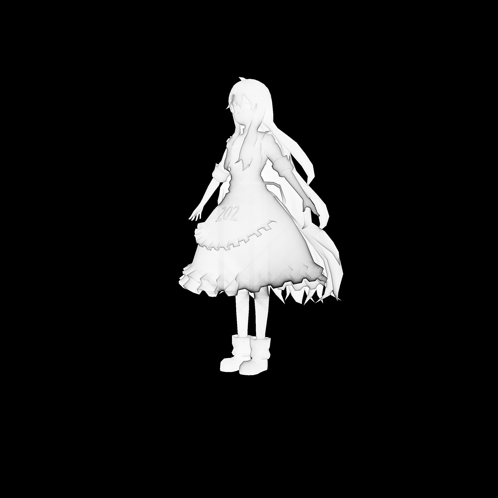

# 渲染结果
### 仅加载纹理

<!--  -->  

### Blinn Phong 模型 (平行光)

### 硬阴影

深度图

### SSAO

800*800

采样数：像素点\*方向(8)*步数(1000)

pow系数：50

2400*2400

采样数：像素点\*方向(8)*步数(1000)

pow系数：50

# 项目结构

- Labs  
  - lab_tex: 纹理加载
  - lab_phong: blinn phong 渲染
  - lab_shadow: two passes hard shadow 渲染
  - lab_SSAO: SSAO 渲染

- QGL
  - pieces.h
    - Frame: 帧数据
    - Zbuffer: Zbuffer结构
    - Sample2D: 纹理采样结构
    - Timer: 计时器结构
    - Log: debug输出
  - types.h
    - ComType | MapType | ModelType | MatrialType

- Models
  - model.h
    - StrangeModel: .obj模型文件
    - BuilinModel

- Rasterizer  
光栅化渲染器

- Shaders (因为只有main引用这些文件，所以都用.h文件来保存)
  - TexShader.h
  - PhongShader.h

- PathTracing
  - PathTracing.h

- Geometry
  - geometry.h
    - Vec2<> | Vec3<> | Vec4<> | Matrix<>

- Utils
  - stb_image : 读取存储图片(https://github.com/nothings/stb)